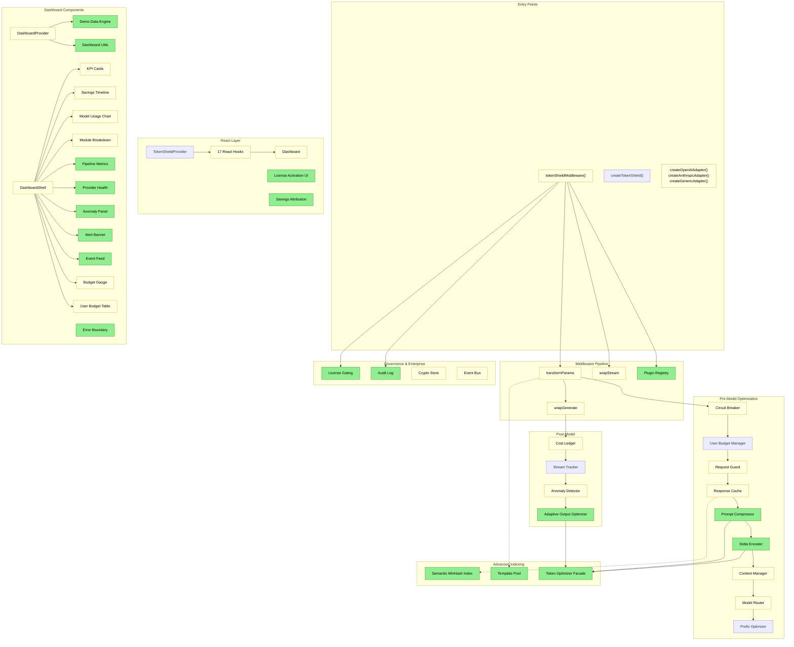

# Code Review & Strategic Forward-Planning — v0.5.0

**Date:** 2026-02-16
**Reviewer:** Senior Principal Engineer
**Scope:** Full codebase audit post v0.5.0 iteration

---

## PART 1: The "Whiteboard" Assessment

### 1.1 Architectural Impact



**Legend:** Green = New | Yellow = Modified | Red = Deprecated

### 1.2 Diff Summary

```
COMPONENT: Core Middleware Pipeline
   CHANGED: middleware.ts (plugin init, audit wiring, license checks, storage:error events)
   CHANGED: middleware-transform.ts (compressor + delta stages)
   CHANGED: middleware-wrap.ts (IDB failure resilience)
   CHANGED: middleware-types.ts (new config fields)
   CREATED: middleware-plugin.ts (Plugin registry)

COMPONENT: Token Optimization Modules (5 new)
   CREATED: prompt-compressor.ts
   CREATED: conversation-delta-encoder.ts
   CREATED: adaptive-output-optimizer.ts
   CREATED: semantic-minhash.ts
   CREATED: prompt-template-pool.ts
   CREATED: token-optimizer.ts (unified facade)

COMPONENT: Enterprise Features
   CREATED: license.ts (HMAC-SHA256 + ECDSA P-256)
   CREATED: audit-log.ts (hash chain, IDB persist, export)
   CREATED: license-activation.tsx
   CHANGED: crypto-store.ts (corruption resilience)

COMPONENT: Pricing Infrastructure
   CHANGED: pricing-registry.ts (single source of truth)
   CHANGED: cost-estimator.ts (consolidated pricing)
   CREATED: data/models.json
   CREATED: scripts/sync-pricing.ts
   CREATED: scripts/validate-pricing.ts

COMPONENT: Dashboard (Full Redesign)
   CHANGED: dashboard-provider.tsx (split contexts)
   CREATED: demo-data-engine.ts (840 lines)
   CREATED: dashboard-utils.ts
   CREATED: 8 new panel components
   CREATED: error-boundary.tsx

COMPONENT: Test Infrastructure
   CREATED: 17 new test files
   Result: 70 files, 1352 tests, 86.3% statement coverage
```

### 1.3 Intent vs. Reality Audit

**Edge Cases Ignored:**

| Edge Case                                          | Risk     |
| -------------------------------------------------- | -------- |
| No real ECDSA key distribution system              | Low      |
| models.json pricing can go stale between releases  | Medium   |
| BroadcastChannel unavailable in some edge runtimes | Low      |
| pricing-registry.ts at 48% coverage                | **High** |
| shield-worker.ts at 57% coverage                   | Medium   |
| Dashboard `mode: "live"` has no real data source   | Medium   |

**Technical Debt:**

| Debt Item                                          | Interest |
| -------------------------------------------------- | -------- |
| pricing-registry.ts at 48% coverage                | **High** |
| `as Record<string, unknown>` casts in audit wiring | Low      |
| `token-shield-updated/` dead directory in repo     | Low      |
| 60% branch coverage threshold is lenient           | Medium   |

### 1.4 Quality Matrix

| Dimension   | Score | Critique                                                                           |
| ----------- | ----- | ---------------------------------------------------------------------------------- |
| Robustness  | 7/10  | pricing-registry at 48%, shield-worker at 57%, branch coverage 74%                 |
| Readability | 8/10  | Good JSDoc, clear module docstrings. Audit wiring block is repetitive              |
| Performance | 8/10  | Split contexts, O(1) MinHash, proper memoization. No N+1 patterns                  |
| Security    | 8/10  | AES-GCM + PBKDF2 210k. ECDSA P-256. No secrets. generateTestKeySync still callable |
| Scalability | 7/10  | In-memory maps with caps. fetchLatestPricing has no debounce                       |

**Composite: 7.6/10**

---

## PART 2: Opportunity Mining

### 2.1 Perspectives

**User:** No way to see real savings. Pricing might be stale. Can't toggle modules from UI.

**Developer:** middleware.ts mixes too many concerns. Audit wiring is copy-paste. pricing-registry is untested.

**Product Owner:** Needs before/after split view, one-click connect flow, and billing CSV import for killer demo.

### 2.2 Leverage

- `textSimilarity` in response-cache.ts reinvents what semantic-minhash.ts provides
- Split-context pattern in dashboard should be adopted in TokenShieldProvider
- `useReducedMotion` used in dashboard but not landing page
- Pipeline composable API is exported but has no examples or docs

---

## PART 3: Strategic Menu

See Options A-G in the full review document.

## PART 4: Recommendation

**Golden Path:** Option A (Pricing Coverage) + Option D (Remove Dead Dir) + Option B (Type-Safe Events)

**Quality Path:** Add Option G (Raise Coverage Floor) + Option E (Reduced Motion a11y)

**If one pick:** Option A — pricing accuracy is the foundation of every savings number.
